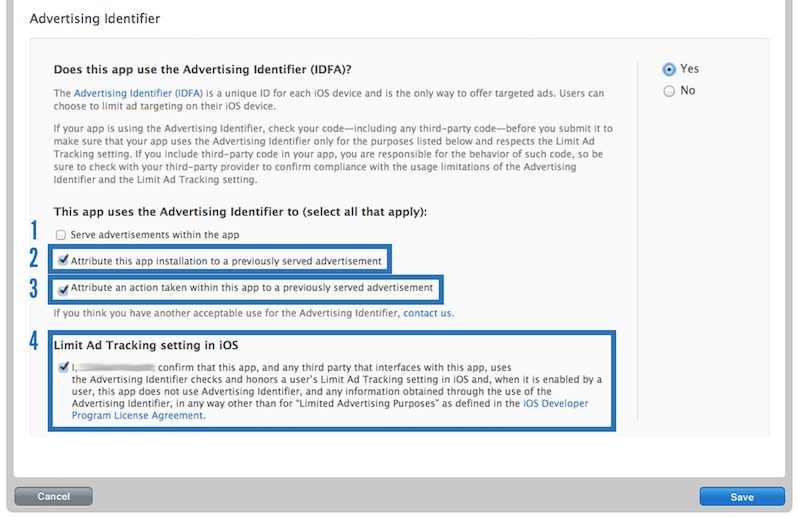

# RAnalytics iOS SDK

1. [Introduction](#introduction)
1. [Getting support](#getting-support)
1. [Source code repository](#source-code-repository)
1. [Getting started](#getting-started)
1. [Tracking events](#tracking-events)
1. [ID-SDK and OMNI compatibility](#id-sdk-and-omni-compatibility)
1. [RAT examples](#rat-examples)
1. [Knowledge base](#knowledge-base)
1. [Advanced configuration and usage](advanced_usage.html)
1. [Build and run module](#build-and-run-module)
1. [Troubleshooting](#troubleshooting)
1. [Changelog](changelog.html)

# Introduction

The **analytics** module provides APIs for tracking events and automatically sends a subset of lifecycle events to the [Rakuten Analytics Tracker](https://confluence.rakuten-it.com/confluence/display/RAT/RAT+Home) (RAT) service.

⚠️ This module supports iOS 12.0 and above. It has been tested with iOS 12.5 and above. Our minimum supported version is updated annually based on the OS version share on [ReX](http://rex.public.rakuten-it.com/design/accessibility/system-requirements/os-and-browser/).

# Getting support

To get support (create crash or bug reports, make feature requests, ask questions etc.) please create an inquiry from our [SDK Customer Support Portal](https://confluence.rakuten-it.com/confluence/x/Aw_JqQ).

To enable us to better support you, the following steps are recommended *before* creating an [SDK inquiry](https://confluence.rakuten-it.com/confluence/x/Aw_JqQ):
  * Give the DLM `dev-mag-mobile-sdk` access to your git source repo and include your repo URL on any inquiry ticket
  * If you are reporting a crash, please also give the members of DLM `dev-mag-mobile-sdk` access to your crash reporting dashboard e.g. Firebase Crashlytics


# Source code repository

The Analytics SDK source is hosted on Rakuten GitPub https://gitpub.rakuten-it.com/projects/ECO/repos/core-ios-analytics/browse - everyone with GitPub read access can view the source.

# Getting started

## Requirements

Xcode 12.5.x or Xcode 13+

Swift >= 5.4 is supported.

Note: The SDK may build on earlier Xcode versions but it is not officially supported or tested.

### Building app for App Store

Xcode 13 introduced an option (**enabled** by default) to automatically manage app version numbering. Exporting your app with this option enabled breaks the Analytics SDK’s framework version tracking feature. 

When exporting for the App Store please disable the option “Manage Version and Build Number” in the Xcode UI. See this [Discourse post](https://discourse.tech.rakuten-it.com/t/xcode-13-versioning-change-for-export-breaks-our-sdk-adoption-tracking/5610) for full details, including how to disable the option when using xcodebuild or fastlane.

If you prefer to keep this option enabled, be aware that the SDK will not be able to track the versions of your embedded SDKs/frameworks. Also, please notify us by raising an [inquiry](https://confluence.rakuten-it.com/confluence/x/Aw_JqQ) so we can monitor how many apps are using this Xcode option to manage build version automatically.

## Installing

### Cocoapods

To use the module in its default configuration your `Podfile` should contain:

```ruby
source 'https://cdn.cocoapods.org/'
source 'https://gitpub.rakuten-it.com/scm/eco/core-ios-specs.git'

pod 'RAnalytics'
```

Run `pod install` to install the module and its dependencies.

⚠️ The analytics module since version 3.0.0 is separated into `Core` and `RAT` subspecs. 

The default subspec is `RAT`, which depends on `Core`. 

If you do not want automatic user tracking sent to RAT you should use the `Core` subspec in your Podfile:

```ruby
source 'https://cdn.cocoapods.org/'
source 'https://gitpub.rakuten-it.com/scm/eco/core-ios-specs.git'

pod 'RAnalytics/Core'
```

### Swift Package Manager

Open your project settings in Xcode and add a new package in 'Swift Packages' tab:
* Repository URL: `ssh://git@gitpub.rakuten-it.com:7999/eco/core-ios-analytics.git`
* Version settings: 9.2.0 "Up to Next Major" (9.2.0 is the first version to support SPM)

Choose `RAnalytics` product for your target. If you want to link other targets (Notification Service Extension, Notification Content Extension, etc), go to Build Phases of that target, then in Link Binary With Libraries click + button and add `RAnalytics`.

Please refer to `Tracking events in iOS Extensions` section if you track events in your iOS Extensions.

### Troubleshooting tip

If you can't checkout the RAnalytics Swift Package in Xcode, please execute these 2 command lines:
```
/usr/libexec/Plistbuddy -c "Add :IDEPackageSupportUseBuiltinSCM bool 1" ~/Library/Preferences/com.apple.dt.Xcode.plist
xcodebuild -scheme MyScheme -resolvePackageDependencies -usePackageSupportBuiltinSCM
```

## Importing the module to use it in your app

### Swift
```
import RAnalytics
```

### Objective-C
```
@import RAnalytics;
```

## RAT credentials

* You must have a RAT account ID and application ID to track events using the Rakuten Analytics Tracker. Apply for these credentials from this [form](https://confluence.rakuten-it.com/confluence/display/RAT/Application+for+RAT+Implementation) on the RAT site.

## Configuring RAT

⚠️ Applications **MUST** configure their RAT `accountId` and `applicationId` in their info.plist as follows:


##### Plist Configuration


| Key    | Value     |
|  -------- | -------- |
| `RATAccountIdentifier` | `YOUR_RAT_ACCOUNT_ID` (Number type) |
| `RATAppIdentifier` | `YOUR_RAT_APPLICATION_ID` (Number type) |


## Using Kibana to verify successful integration

RAT's [Kibana](https://confluence.rakuten-it.com/confluence/display/RAT/How+to+Check+Data+that+is+being+Sent+to+RAT#HowtoCheckDatathatisbeingSenttoRAT-Step2:[ServerSide]ChecktheeventonRATserver) STG and PROD sites can be used to check events sent by your app.

To find all analytics data for your app, you can search for your Application Identifier `aid:999` or `app_name:<your bundle id>`.

To find data for a certain event type, such as one of the [standard events](#standard-events), you can add the `etype` to your search query, for example `aid:999 AND etype:_rem_launch`.

# Tracking events

Events are created with `RAnalyticsEvent#initWithName:parameters:` and spooled by calling their track method.

#### Tracking generic events

Tracking a generic event relies on a tracker capable of processing the event currently being registered.

```swift
AnalyticsManager.Event(name: "my.event", parameters: ["foo": "bar"]).track()
```

#### Tracking RAT-specific events

A concrete tracker, `RAnalyticsRATTracker`, is automatically registered and interacts with the **Rakuten Analytics Tracker (RAT)**. You can also use `RAnalyticsRATTracker#eventWithEventType:parameters:` for creating events that will only be processed by RAT. For more information about the various parameters accepted by that service, see the [RAT Parameter Spec](https://confluence.rakuten-it.com/confluence/display/RAT/RAT+Parameter+Specifications).

> **Note:** Our SDK automatically tracks a number of RAT parameters for you, so you don't have to include those when creating an event: `acc`, `aid`, `etype`, `powerstatus`, `mbat`, `dln`, `loc`, `mcn`, `model`, `mnetw`, `mori`, `mos`, `online`, `cka`, `ckp`, `cks`, `ua`, `app_name`, `app_ver`, `res`, `ltm`, `ts1`, `tzo`, `userid` and `ver`.

```swift
RAnalyticsRATTracker.shared().event(eventType: "click", parameters:["pgn": "coupon page"]).track()
```

> You can override the `acc` and `aid` default values by including those keys in the `parameters` dictionary when you create an event.

```swift
RAnalyticsRATTracker.shared().event(eventType: "click", parameters:["acc": 123]).track()
```

## Standard events

The SDK will automatically send events to the Rakuten Analytics Tracker for certain actions. The event type parameter for all of these events are prefixed with `_rem_`. We also provide named constants for all of those.


| Event name    | Description     |
|  -------- | -------- |
| `_rem_init_launch` | Application is launched for the first time ever.     |
| `_rem_launch` | Application is launched.     |
| `_rem_end_session` | Application goes into background.     |
| `_rem_update` | Application is launched and its version number does not match the version number of the previous launch.     |
| `_rem_login` | User logged in successfully.     |
| `_rem_logout` | User logged out.     |
| `_rem_install` | Application version is launched for the first time.     |
| `_rem_visit` | A new page is shown. Application developers can also emit this event manually if they wish so, for instance to track pages that are not view controllers (e.g. a table cell). In that case, they should set the event's parameter `page_id` to a string that uniquely identifies the visit they want to track.     |
| `_rem_push_received` | A push notification has been received while the app was in background or in foreground.    |
| `_rem_push_notify` | A push notification has been opened while the app was active, or the app was opened from a push notification. A value that uniquely identifies the push notification is provided in the `tracking_id` parameter. See its definition below.    |
| `_rem_push_auto_register` | A pnp auto registration occured.    |
| `_rem_push_auto_unregister` | A pnp auto unregistration occured.    |


For a full list and more details see the [SDK Standard Event Spec](https://confluence.rakuten-it.com/confluence/display/MAGS/Analytics+SDK+-+SDK+Tracking+Specification+for+RAT#AnalyticsSDKSDKTrackingSpecificationforRAT-AutomaticsEvents).

##### Push notification tracking identifier

The value for the `tracking_id` parameter of `_rem_push_notify` and `_rem_push_received` events is computed like this:

* If the notification payload contains a value named `rid`, `tracking_id` takes the value `rid:<value>`.
* Else, if the notification payload contains a value named `notification_id`, `tracking_id` takes the value `nid:<value>`.
* Else, `tracking_id` uses the message or title of the push notification and takes the value `msg:<SHA256(message or title)>`.

#### Requirements

The below table shows the required components of each standard event which is tracked automatically by the **analytics** module.


| Event name    | Required components     |
|  -------- | -------- |
| `_rem_login` | **authentication** module (3.10.1 or later).     |
| `_rem_logout` | **authentication** module (3.10.1 or later).    |

#### Automatically Generated State Attributes

The SDK will automatically generate certain attributes about the state of the device, and pass them to every registered tracker when asked to process an event.

## Push conversion tracking
Conversions are an important metric for marketers. The SDK now supports a conversion event which can be sent when a conversion occurs in your app.

To use this feature you need to store the APNs push notification payload when your app is opened from a push notification.
Then, when a conversion event occurs (you define these for your own app's specific use cases e.g. item purchase) you can track the conversion to RAT as follows:

```swift
let pushRequestIdentifier = RAnalyticsPushTrackingUtility.requestIdentifier(from: apnsPayload)

RAnalyticsPushTrackingUtility.trackPushConversionEvent(pushRequestIdentifier: pushRequestIdentifier, pushConversionAction: "{client_defined_conversion_action_name}")

```

## Tracking events in iOS Extensions

### Warning
Don't directly call the AnalyticsManager singleton to track events in your iOS Extensions as you will get:
- missing parameters such as userid, easyid
- incorrect endpoint URL

Use the iOS Extension Event Tracking feature instead.

### How to use the iOS Extension Event Tracking feature
To enable iOS Extension Event Tracking set the following property in your **main app**:
```swift
AnalyticsManager.shared().enableExtensionEventTracking = true
```

Then you can track events in your iOS extensions using the following function:
```swift
AnalyticsEventPoster.post(name: "myEventName", parameters: ["key1": "value1"])
```

## Tracking events in SwiftUI views

To track page visit events in your SwiftUI apps, call this function in your SwiftUI views body:
```
public func rviewOnAppear(pageName: String, perform action: (() -> Void)? = nil) -> some View
```

This function above calls SwiftUI's `onAppear` internally.
https://developer.apple.com/documentation/SwiftUI/AnyView/onAppear%28perform:%29

Example:
```swift
struct ContentView: View {
    var body: some View {
        NavigationView {
            VStack {
                NavigationLink(destination: PageView()) {
                    Text("Page 1")
                }
                NavigationLink(destination: PageView()) {
                    Text("Page 2")
                }
            }.rviewOnAppear(pageName: "contentView") {
            }
        }
    }
}
```

# ID-SDK and OMNI Compatibility

The IDSDK member identifier needs to be set and unset manually in order to track login and logout events with the correct member identifier.
In most cases, the value you set as member identifier should be the member's easy identifier. The easy identifier can be extracted from the IDSDK ID token.

## Handle login

When you successfully [acquire an ID-SDK session](https://pages.ghe.rakuten-it.com/id-sdk/specs/user-guide/#session-request) you should notify the RAnalytics SDK of the user's member identifier (Easy ID) using `setMemberIdentifier`. 

To get the Easy ID from the token use the [idsdk-compatibility library's](https://gitpub.rakuten-it.com/projects/ECO/repos/ios-idsdk-compatibility/browse) `memberIdentifier` extension property on the IDSDK `Session`, or extract it using `token[StandardClaim.subject]`.

```swift
client.session(request: sessionRequest,
               mediationOptions: mediationOptions) { result in
    if case let .success(session) = result {
        self.session = session
        if let easyID: String = session.memberIdentifier {
            AnalyticsManager.shared().setMemberIdentifier(easyID)
        }
    }
}
```

Note: By setting the member identifier, `_rem_login` is automatically tracked.

## Handle login failure

If user login fails, notify the RAnalytics SDK using `setMemberError` as follows:

```swift
client.session(request: sessionRequest,
               mediationOptions: mediationOptions) { result in
    switch result {
    case .success(let session):
        // handle success
    case .failure(let error):
        // handle failure
        AnalyticsManager.shared().setMemberError(error)
    }
```

Note: By setting a member error, `_rem_login_failure` is automatically tracked.

## Handle logout

When a user logs out, notify the RAnalytics SDK using `removeMemberIdentifier` as follows:

```swift
session.logout() { result in
    if case .success = result {
        // Successfully logged out.
        AnalyticsManager.shared().removeMemberIdentifier()
    } else if case let .failure(error) = result {
        // Failed.
    }
}
```

Note: By removing the member identifier, `_rem_logout` is automatically tracked.

## Verifying successful integration

If the addon library was correctly integrated, the events sent to RAT for a logged-in user will contain an `easyid` field containing the user's member identfier (Easy ID). See [here](#using-kibana-to-verify-successful-integration) for a guide on how to check the events sent to RAT.

# RAT Examples

**Note:** These examples all use `RAnalyticsRATTracker` to send [RAT specific parameters](https://confluence.rakuten-it.com/confluence/display/RAT/RAT+Parameters+Definition). If you are using a custom tracker, `RAnalyticsEvent` should be used instead.


## UI Interaction

The following code is an example that can be used to track button clicks. It uses RAT's standard `click` event and passes the page name, clicked element's id and goal id in the `pgn`, `target` and `gol` parameters, respectively.

```swift
@IBAction func buttonTapped(sender: UIButton) {
    RAnalyticsRATTracker.shared().event(eventType: "click",
                             parameters:["pgn": "Main",
                                         "target": "search_btn",
                                         "gol": "goal123456"]).track()
}
```

## RAT events with Custom Parameters

The following is an example of tracking an event with custom parameters. It uses the standard `pv` RAT event used in the previous examples, and passes some custom `custom_param_##` parameters in the `cp` dictionary accepted by RAT for this purpose.

```swift
RAnalyticsRATTracker.shared().event(eventType: "pv",
                         parameters:["pgn": "Main",
                                     "cp": ["custom_param_1": "value",
                                            "custom_param_2": 10,
                                            "custom_param_3": true]]).track()
```

# Knowledge Base

## Migrating to v9.4.0

### IDSDK Login/Logout Tracking

From v9.4.0 of the SDK the member tracking functionality from [ios-analytics-idtoken](https://gitpub.rakuten-it.com/projects/ECO/repos/ios-analytics-idtoken/browse) has been added to the `AnalyticsManager` class.

Therefore:
- Remove the `ios-analytics-idtoken` dependency from your Podfile or from your Swift Package Manager configuration
- Start using the new `AnalyticsManager`'s Member API instead

Refer to [ID-SDK and OMNI compatibility](#id-sdk-and-omni-compatibility) section for more information.

## Migrating from previous versions to v9

### iOS Extension Event Tracking

The iOS Extension Event Tracking feature is disabled by default.

In order to track `_rem_push_received` and `_rem_push_notify` events, you have to set the following property in your **main app**:
```swift
AnalyticsManager.shared().enableExtensionEventTracking = true
```

Note: `_rem_push_notify` is tracked in any case for standard push notifications.

### shouldTrackPageView
`shouldTrackPageView` var in `AnalyticsManager` has been removed in version 9.0.0
To disable automatic page view tracking you should add `_rem_visit` to `RATDisabledEventsList` array in your Info.plist file OR use `AnalyticsManager.shared().shouldTrackEventHandler` to filter out `AnalyticsManager.Event.Name.pageVisit` event:
```swift
AnalyticsManager.shared().shouldTrackEventHandler = { eventName in
    eventName != AnalyticsManager.Event.Name.pageVisit
}
```
You can learn more about Automatic Tracking Configuration feature in [Advanced Usage](advanced_usage.html#configure-automatic-tracking) docs.

### Endpoint
This function has been removed in version 9.0.0:
```swift
@objc public static func endpointAddress() -> URL?
```
Simply replace `RAnalyticsRATTracker.endpointAddress()` by `RAnalyticsRATTracker.shared().endpointURL`.

### Events

#### RAnalyticsEvent.Name
RAnalyticsEvent.Name is no longer accessible from Objective-C classes.

#### RAnalyticsEvent.Parameter
RAnalyticsEvent.Parameter is no longer accessible from Objective-C classes.

#### RAnalyticsEvent.LogoutMethod
RAnalyticsEvent.LogoutMethod is no longer accessible from Objective-C classes.

## Migrating from v2 to v3

* 2.13.0 is the final version of the RSDKAnalytics podspec. It has been renamed to RAnalytics podspec from version 3.0.0.
* Version 3.0.0 restructures the module and splits the functionality into `Core` and `RAT` subspecs.
* See [Configuring RAT](#configuring-rat) for the new plist approach for setting account ID and application ID. This replaces the deleted methods `configureWithAccountId:` / `configureWithApplicationId:`.
* If you use the Analytics module directly in your app source (e.g. to track custom events) you will need to change all references (header imports, method calls etc.) from `RSDKAnalytics` to `RAnalytics`. Also, if you call `RATTracker` methods you will need to change those references to `RAnalyticsRATTracker`. This renaming was required so that module versions v2 and v3 can co-exist in an app binary.
* To depend on RAnalytics rather than RSDKAnalytics your Podfile should contain:

```ruby
source 'https://cdn.cocoapods.org/'
source 'https://gitpub.rakuten-it.com/scm/eco/core-ios-specs.git'

pod 'RAnalytics'
```

## AppStore Submission Procedure

Apple requests that you **disclose your usage of the advertising identifier (IDFA)** when releasing your application to the App Store.

IDFA usage disclosure

#### 1. Serve advertisements within the app.

Check this box if any of the following options apply to your app:

* Your app contains advertisements.
* You are using the **RDiscover** SDK module.

#### 2. Attribute this app installation to a previously served advertisement

Check this checkbox. The Rakuten SDK uses the IDFA for install attribution.


#### 3. Attribute an action taken within this app to a previously served advertisement

Check this checkbox. The Rakuten SDK uses the IDFA for re-engagment ads attribution.

#### 5. iOS Limited Ad Tracking

The Rakuten SDK fully complies with Apple requirement below:

Check the value of this property before performing any advertising tracking. If the value is NO, use the advertising identifier only for the following purposes: frequency capping, conversion events, estimating the number of unique users, security and fraud detection, and debugging. 

The Rakuten SDK only uses the IDFA for `conversion events, estimating the number of unique users, security and fraud detection`.


## Push Notification Open Rate

From SDK version 5.2.0 open count tracking has been changed to only send an open event when a push message has been directly opened by the user. It is **highly recommended** to implement the **UNUserNotificationCenter** delegate method: [`userNotificationCenter(_:didReceive:withCompletionHandler:)`](https://developer.apple.com/documentation/usernotifications/unusernotificationcenterdelegate/1649501-usernotificationcenter) because it will more reliably track the push notification open count. If you only implement the **AppDelegate** methods [`application(_:didReceiveRemoteNotification:fetchCompletionHandler:)`](https://developer.apple.com/documentation/uikit/uiapplicationdelegate/1623013-application) or [`application(_:didReceiveRemoteNotification:)`](https://developer.apple.com/documentation/uikit/uiapplicationdelegate/1623117-application) your open rate will not be accurate.


## Tracking search results with RAT

The code below shows an example of an event you could send to track which results get shown on a search page. It uses the standard `pv` RAT event used in the previous examples, and a number of standard RAT parameters. The parameters used are:


| RAT param    | Description     |
|  -------- | -------- |
| `lang` | The language used for the search.     |
| `sq` | The search terms.     |
| `oa` | `a` for requesting all search terms (AND), `o` for requesting one of them (OR).     |
| `esq` | Terms that should be excluded from the results.     |
| `genre` | Category for the results.     |
| `tag` | An array of tags.    |

```swift
RAnalyticsRATTracker.shared().event(eventType: "pv",
parameters:["pgn": "shop_search",
"pgt": "search",
"lang": "English",
"sq": "search query",
"oa": "a",
"esq": "excluded query",
"genre": "category",
"tag": ["tag 1", "tag 2"]]).track()
```

## Monitoring RAT traffic

You can monitor the tracker network activity by listening to the `RAnalyticsWillUploadNotification`, `RAnalyticsUploadFailureNotification` and `RAnalyticsUploadSuccessNotification` notifications.

## How page views are automatically tracked

We use method swizzling to automatically trigger a visit event every time a new view controller is presented, unless:
* The view controller is one of the known "chromes" used to coordinate "content" view controllers, i.e. one of `UINavigationController`, `UISplitViewController`, `UIPageViewController` and `UITabBarController`.
* The view controller is showing a system popup, i.e. `UIAlertView`, `UIActionSheet`, `UIAlertController` or `_UIPopoverView`.
* Either the view controller, its view or the window it's attached to is an instance of an Apple-private class, i.e. a class whose name has a `_` prefix and which comes from a system framework. This prevents many on-screen system accessories from generating bogus page views.
* The class of the window the view controller is attached to is a subclass of `UIWindow` coming from a system framework, i.e. the window is not a normal application window. Certain on-screen system accessories, such as the system keyboard's autocompletion word picker, would otherwise trigger events as well.

Those visit events are available to all trackers, and the view controller being the event's subject can be found in the currentPage property of the event state passed to `RAnalyticsTracker#processEvent:state:`.

The RAT tracker furthermore ignores view controllers that have no title, no navigation item title, and for which no URL was found on any webview part of their view hierarchy at the time `-viewDidLoad` was called, unless they have been subclassed by the application or one of the frameworks embedded in the application. This filters out events that would give no information about what page was visited in the application, such as events reporting a page named `UIViewController`. For view controllers with either a title, navigation item title or URL, the library also sets the `cp.title` and `cp.url` fields to the `pv` event it sends to RAT.

# Build and run module

* Clone or fork the [iOS analytics repository](https://gitpub.rakuten-it.com/projects/ECO/repos/core-ios-analytics/browse)  
* `cd` to the repository folder
* Run `bundle install --path vendor/bundle`

### Unit tests

* Run `bundle exec pod install` to install dependencies
* Open `CI.xcworkspace` in Xcode then build/run

### Sample app

* Run `bundle exec fastlane ios build_sample`
  - By default the `RAnalyticsSample` app depends on the compiled `RAnalytics` framework which gets built via this command invocation. It will also install dependencies.
* Open `Samples/RAnalyticsSample.xcworkspace` in Xcode then run

# Troubleshooting

## How to build your project without use_frameworks!

RAnalytics is a Swift framework and contains a custom module map.

If `use_frameworks!` is not defined in your app's Podfile the following Cocoapods error occurs:


> `Using Swift static libraries with custom module maps is currently not supported.`

To solve this problem:
1. add `cocoapods-user-defined-build-types` plugin to your Podfile
1. declare `RAnalytics` and its dependencies as `static_framework` as follows:

```
plugin 'cocoapods-user-defined-build-types'
enable_user_defined_build_types!

source 'https://github.com/CocoaPods/Specs.git'
source 'https://gitpub.rakuten-it.com/scm/eco/core-ios-specs.git'

target 'MyApp' do
  pod 'RAnalytics', :build_type => :static_framework
  pod 'RLogger', :build_type => :static_framework
end
```

⚠️ **Note:** The `cocoapods-user-defined-build-types` plugin is developed by a third party and we cannot guarantee that its support will continue.
